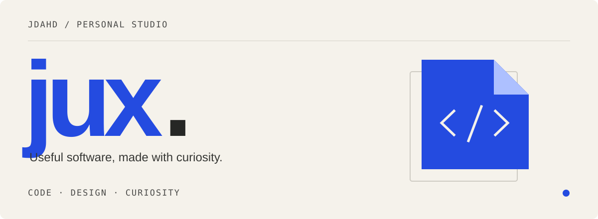

### 你好，我是 jux。

把日常遇到的小麻烦，做成顺手的软件。

这里放着我的工具、界面实验，以及学习开源项目留下的线索。我关注 **本地工具、阅读体验和 AI 辅助开发**，也愿意花时间打磨一个按钮、一段动画，直到它用起来舒服。

Personal tools · Interface experiments · Learning in public

 

## Selected work / 作品

### [Articles-Auto ↗](https://github.com/jdahd/Articles-Auto)

**让网页文章回到阅读本身。**

一个 Python 桌面工具：将文章链接整理成适合离线阅读的内容，支持 Markdown、HTML 和 Word 等格式，并把图片保存到本地。

`Python` · `CustomTkinter` · `Content extraction` · `Offline reading`

[查看源码 →](https://github.com/jdahd/Articles-Auto)

 

## On the workbench / 工作台

**工具** — 把重复操作变成更短的流程，让内容留在自己手里。 
**界面** — 研究布局、层次与动效，关心实际使用时的手感。 
**AI** — 尝试把 AI 放进开发流程，也回到代码里理解它怎样工作。

 

## Reading the source / 源码书架

一些我收藏、fork 和学习的项目。下面的链接指向原作者仓库。

- [Claude Code](https://github.com/anthropics/claude-code) — AI 编程工具与工作流。
- [Awesome Design Systems](https://github.com/alexpate/awesome-design-systems) — 设计系统、组件与视觉语言。
- [Article Tools](https://github.com/eternityspring/article-tools) — 文章封面与排版工具。

 

---

Stay curious. Make something useful. 
[Browse my repositories ↗](https://github.com/jdahd?tab=repositories)
