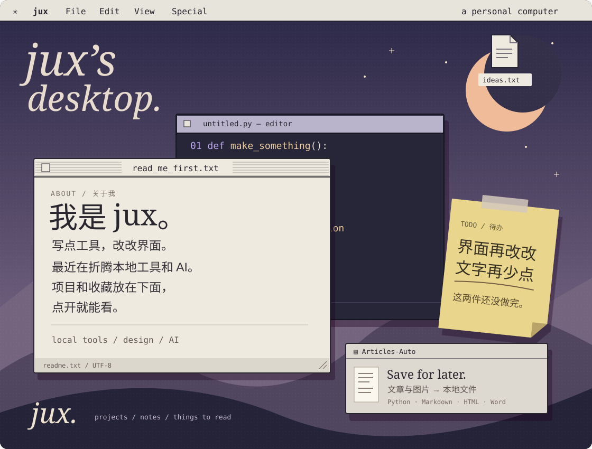

<a href="https://github.com/jdahd/Articles-Auto"><b>▤ Articles-Auto</b></a> &nbsp; / &nbsp;
<a href="https://github.com/jdahd?tab=repositories"><b>▱ 项目文件夹</b></a> &nbsp; / &nbsp;
<a href="https://github.com/jdahd?tab=stars"><b>✳ 我的收藏</b></a>

 

我是 jux，写点工具，改改界面。这里放自己的项目，也收藏值得读的代码。

<b>打开文件夹</b>

 

**[Articles-Auto](https://github.com/jdahd/Articles-Auto)** 
把文章和图片保存到本地，导出 Markdown、HTML、Word。用 Python 写的桌面工具。

**[设计系统书架](https://github.com/alexpate/awesome-design-systems)** 
收藏的设计系统资料，来自 alexpate/awesome-design-systems。

**[AI 开发工具](https://github.com/anthropics/claude-code)** 
关注的 AI 编程工具，来自 anthropics/claude-code。

 

jux / @jdahd
