<picture>
  <source media="(prefers-reduced-motion: reduce)" srcset="assets/double-sided-static.svg" />
  
</picture>

  <a href="https://github.com/jdahd/Articles-Auto">Articles-Auto ↗</a> &nbsp; &nbsp;
  <a href="https://github.com/jdahd?tab=repositories">Repositories ↗</a> &nbsp; &nbsp;
  <a href="https://github.com/jdahd?tab=stars">Stars ↗</a>

